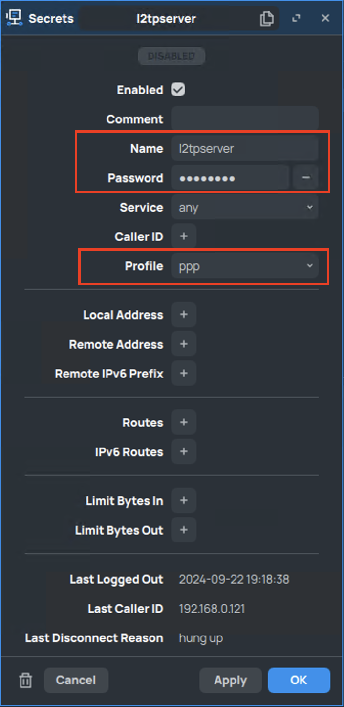

# Настройка L2TP сервера на MicroTik роутере

## 1. Настройки пула адресов

`IP` -> `Pool`

## 2. Настройки профиля

`PPP` -> `Profiles`

В настройке `Remote Address` выбран пул из настройки в предыдущем пункте.

## 3. Настройки авторизации

`PPP` -> `Secrets`

В настройке `Profile` выбран профиль из настроки в предыдущем пункте.

## 4. Включение l2tp сервера

`PPP` -> `Interface` -> `L2TP Server`

## 5. Настройки NAT

`IP` -> `Firewall` -> `NAT`

[Источник](https://vk.com/video?q=Настройка%20защищённого%20VPN%20L2TP%20на%20маршрутизаторе.&z=video-34914823_456239303%2Fpl_cat_trends)
